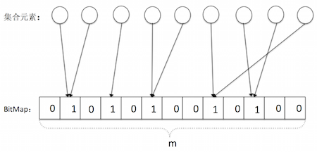
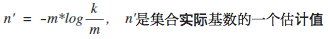
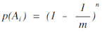
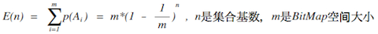
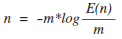
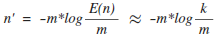
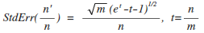
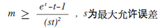

title: 基数估算算法-Linear Counting
date: 2015-10-10 20:58:17
tags: 算法
---
在实际应用中，我们经常会碰到这样一类问题，假如有一个包含重复数据的集合，需要我们找出这个集合中不同的数据的个数，即该集合的基数。

简单的做法是，将集合数据读入到一个Map中，字符串作为key，出现的次数作为value，通过Map的长度就可以知道集合的基数，但是该方法仅仅适合于数据量很少的情况下，当数据量大到足以撑爆机器内存时，该方法将无能为力了。

该有另一种比较重量级的做法就是使用Hadoop的MapReduce；将数据集合存储到Hadoop中，整个过程类似于Mapreduce的经典案例-统计文本中每个单词数据的次数-一样，区别仅仅在获取的结果不一样而已。

那么有没有轻量级，并且能处理海量数据集合的方法来获取集合的基数呢？ 当然有，我们将通过两篇文档介绍基数估算的方法，本片介绍其中的一种算法：Linear Counting， 另一篇介绍Loglog Counting算法。

# 简介
Linear Counting(简称LC)是早起的基数估算算法，目前该算法在实际应用中一般不会被单独使用，因为其在空间复杂度并不是很优秀，空间复杂度为O(N),N为集合中的基数。不过作为LLC算法的思想基础，有必要介绍一下LC，如果你想了解Linear Counting的第一手资料，可以参考论文[A linear-time probabilistic counting algorithm for database applications](http://dl.acm.org/citation.cfm?id=78925).

----
# 算法思想

LC的基本思想就是， 将集合元素通过Hash函数映射到一个[BitMap](http://www.infoq.com/cn/articles/the-secret-of-bitmap)中， 然后通过BitMap中零元素的比例来估算集合的基数。例如一个长度为N的集合和一个Hash函数，hash函数的空间值有m个（从0到m-1），并且Hash结果服从均匀分布，使用一个长度为m的BitMap存储集合的Hash结果，BitMap中每一个bit是一个桶，初始值为0。

- 首先计算集合中每个算法的hash值，并以该hash值作为BitMap下标，设置对应位置的值为1（如果不为1的话）；最终将得到如下如所示的一个BitMap：
 

- 获取BitMap中元素值为0的个数为k， 则集合的基数n的估算公式为：
 

 >区别于集合元素映射到等长的BitMap中的方法；上述方法BitMap长度小于集合大小，在一定程度上节省了空间。

# 公式推导

- 集合中每个数据hash后设置BitMap对应下标位置的元素值为1；假如对于一个数据，BitMap第i个元素被设置为1的概率为1/m, 被设置为0的概率为(1-1/m)。*由于我们已经假设Hash函数结果服从均匀分布，因此Hash到空间各个位置的概率是相等的*。

- 假设集合的基数为n，经过n个不同数据的Hash设置，BitMap中第i个元素值为0的概率为：
 

 
- 由于BitMap中每个bit(桶)都相互独立，那么BitMap中值为0的元素个数的期望值为：
 

 从而可以推导出，集合基数n的计算公式为：
 

 而k可以作为空桶数的期望值E(n)的一个最大似然估计值，那么集合基数估计值公式则为：
 

 >上述公式中的k即一次实验中随机得到的BitMap中空桶的个数，可以认为是空桶期望值的最大似然估计，即认为E(n)约等于k.

----
# 算法说明
算法的标准误差计算公式可以参考论文“A linear-time probabilistic counting algorithm for database applications”，这直接给出公式：
 

### BitMap空间大小选择
假设我们需要控制误差在s内，则：
  

  
  

 
### 满桶控制
  当BitMap的长度m远小于集合基数n时，可能会导致BitMap中所有的元素都被映射到，即空桶数量k为0，则将会导致LC的估值无限大，起不到任何作用；即输入需要LC起到比较好的效果的话，就需要BitMap的长度与集合基数接近，这就是LC的空间复杂度不好的原因。因此Bitmap并不适合集合基数太大的情况。
