title: 关于多维高斯分布，以及混合高斯模型的介绍
date: 2016-01-12 18:09:20
tags: 机器学习 算法
---

高斯分布作为一个重要的概率分布函数，在数据统计方面应用比较广泛，比如判断一个事件发生的概率，以及在异常判断中都有使用。本文重点不在高斯分布的介绍，而是在高斯分布的另外两个演化算法： **多维高斯分布**和**混合高斯分布**, 这两个算法并不是同一类算法，不太准确的说，***多维高斯分布还是应用于概率统计中，但混合高斯分布更多的是作为聚类算法来使用***。

不过在介绍多维高斯分布和混合高斯分布之前，还是需要先温习一遍高斯分布以及相关计算公式。

 ----
 
## 高斯分布
高斯分布一般用来描述一类事件发生概率的分布，比如人的身高。 什么样的概率分布才能称得上是符合高斯分布呢？ 从高斯分布图示可以知道，事件聚集在某一个中心点附近，并且离中心点越远的发生的概率越低；比如身高，男生身高一般聚集在1.75附近，身高越高或者越低的人的数量越少(即发生的概率越小)，那么身高的分布就符合高斯分布。

> 高斯分布函数就是一个概率密度函数，得出的值就是某一事件值发生的概率。对高斯分布的图的一种解释就是，x轴是事件所有可能的取值，而y轴就是事件每一个值对应的发生概率，高斯分布中某一个区域的面积， 比如从-x0到+x0这段区间的面积，就是事件值落在(-x0, +x0)这个区间的概率和。 高斯分布的面积为1(即所有值发生的概率和就是1)。

* 高斯分布的计算公式

 

上述这个公式，我们就称为x服从中心点为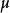标准差                                                                                                                                                                                                                                                                                                                                                                                                                                                                                                                                                                                                                                                             为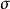高斯分布; 记作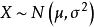

> 均值描述的是事件的平均值，标准差描述的是事件值得聚集程度；标准差越大，说明事件值分布越分散，标准差越小，说明事件值更多的是聚集在均值附近。

* 如何或者高斯分布函数

假如有一个样本集，样本符合高斯分布，那么就可以根据样本集得到高斯分布的均值和方差，从而得到高斯分布函数。均值和方差计算公式如下：

 
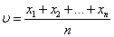

 
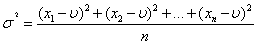

----
## 多维高斯分布
多维高斯分布应用于样本是多维向量的场景，它与高斯分布的区别在于：

* 高斯分布可以针对一维结构的样本集，多维高斯分布则只能针对多维结构的样本。
* 对高斯分布来说，样本中每个属性之间都是独立的，即高斯分布认为样本的属性之间没有关联关系；**而多维高斯分布把属性之间的关联关系也考虑在内**。
* 针对多维向量的样本集合，**高斯分布针对每一个属性得到一个分布函数**， 即针对二维向量的样本，就会得到两个高斯分布； 但是多维高斯只会得到一个高斯分布。
* 高斯分布函数中，样本值、均值和方差都是一个数值；而**在多维高斯分布函数中，样本、均值都是向量，协方差则是一个矩阵**。

### 为什么要使用多维高斯分布
现在考虑这种场景，有一组人，每一个人使用(身高，体重)二维向量表示；现在要计算这组人的高斯分布，并通过高斯分布计算随机的一个人(随机指定的身高和体重)存在的概率。

最简单的方法，分别得出身高和体重的高斯分布函数，从而得到两个高斯分布；假设身高的高斯分布函数为f(x), 体重的高斯分布函数为g(x)；

那么计算身高和体重分别为a和b的人可能存在的概率就是：h(x) = f(a)*g(b)，似乎合情合理！

但是考虑这么两个人，属性分别是(1.90米,50公斤)和（1.90米，80公斤)； 两个人的身高出现的概率一样； 假设体重的均值是65公斤，这两个人的体重的概率值也是一样，最后的得出的结果就是： 这两个人存在的概率是一样一样的；但是真实情况并不是这样，因为身高和体重其实有某种联系的，一般来说身高越高，体重越大。

这时候就可以使用多维高斯分布，即**如果样本的属性之间存在关联关系时，使用多维高斯分布，将属性关联关联考虑在内，得到更准确的概率分布。**

> 属性之间可能存在正向关联关系，比如身高和体重，身高越高，体重越大；也可能存在负向关联关系，比如年龄和速度，年龄越大，速度越低。这种关联关系在多维高斯分布的标准差(矩阵)中体现。

 

如上图所示三个二维样本集的分布图：
* 分布图1中x和y两个属性之间没有明显的关联关系，可以分别针对两个属性得到两个高斯分布函数。
* 分布图2中的x和y两个属性之间具有正向关联关系，使用多维高斯分布更合适。
* 分布图3中的x和y两个属性之间具有反向关联关系，使用多维高斯分布更合适。

### 多维高斯分布公式

#### 多维高斯分布概率密度函数
 
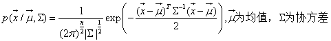

从公式可以看到，多维高斯分布并不像高斯分布那样，只是将各个维度的概率分布函数简单的相乘得到样本出现的概率，而是通过向量(***均值为向量形式***)和矩阵(***协方差为矩阵形式***)的方式，将维度之间的关系也考虑在内。

#### 多维高斯分布函数计算

多维高斯分布函数的计算，就是怎么根据样本点，得到均值和协方差。
假设一个样本集合，属性个数为m，每一维属性都符合高斯分布，第i个样本为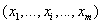；样本个数为n。那么多维高斯分布函数的参数均值和方差的计算公式如下：

* **均值向量计算公式**
 
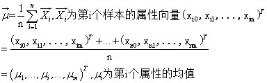

* **协方差计算公式**
 
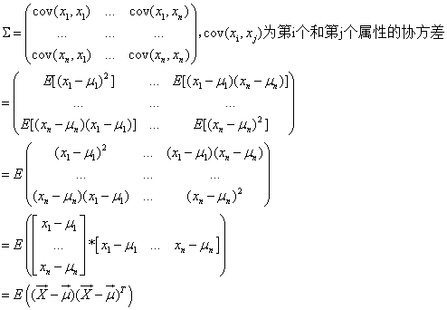

> 从上面公式可知，协方差是一个m*m(样本维度为m)的矩阵，矩阵的每一项都是对应的两个属性的协方差值；比如第i个属性和第j的属性的协方差计算公式为：
> 
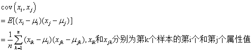

前面有说过，多维高斯分布考虑到了属性之间的关联关系，具体体现在方差矩阵中，怎么体现的。我们看上面的方差计算公式中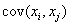就是第i个属性和第j个属性的协方差，两个属性的关系就是使用这个值来体现。**如果等于0，说明第i个属性和第j个属性不存在关联关系；如果值大于0， 则第i个属性和第j个属性正相关, 如果值小于0， 则第i个属性和第j个属性负相关**。
> 所以我们在判断两个属性是否具有相关性，就可以求两个属性的协方差来实现。

----
## 混合高斯模型(GMM)
混合高斯模型是一个**聚类算法**，这点与高斯分布或者是多维高斯分布不同。
> 其实高斯分布和多维高斯分布也可以作为聚类算法来使用，但只能针对两个聚类；大于阀值的是一个cluster，小于阀值的是一个cluster。

**为什么说混合高斯模型是一个聚类算法：**我们从混合高斯模型的公式中看的出来，一个混合高斯模型是由多个高斯分布函数组成，其中的每一个高斯分布函数都对应一个cluster；而每一个cluster中的样本都是符合对应的高斯分布的；即是说， 混合高斯模型是由若干聚类组成，每个聚类都是由高斯分布函数表示，而它的作用也主要是用来判断样本所属聚类。
> 其实混合高斯模型也可以作为分类算法，并且更简单(因为训练样本中不再包含类型这个隐含变量，就不再需要使用EM算法估计参数)，前提条件是你的训练样本带有分类标签；直接针对每一个类，求出其高斯分布函数。但是大部分情况，我们都是在不带标签(即样本的类型是隐含变量)的样本上进行学习，需要应用到最大似然估计算法(EM)，最后得到的若干clusters。***

**混合高斯模型与K-means有什么区别呢？**我们知道K-means也是一个聚类算法，不过在K-means中，对样本点所属类的判断没有概率之说，一个样本要么属于这个cluster，要么属于那个cluster。而混合高斯模型则是另一种方式，计算出样本属于每一个聚类的概率，然后根据阀值决定样本点属于哪个cluster。

### 混合高斯模型公式
混合高斯模型是若干高斯分布函数的组合，可以使用表示：

 
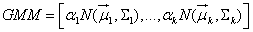

其中k为模型的个数，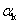为第k个高斯函数的权重(等于属于该高斯分布函数的样本在总样本中的百分比)，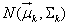为第k个模型的高斯分布函数(是多维高斯分布函数)。

**如果已经有这个一个混合高斯模型，怎么使用，**比如有一个样本点，怎么确定属于哪个cluster。对每个cluster的高斯分布函数，计算样本点对应的概率，取概率最大者为该样本点所属的cluster。

### 如何训练混合高斯模型
假设有一个样本集合，我们假设这个样本集合可以分为k个类，但每个样本点所属类不确定，样本维度为m；怎么计算对应的混合高斯模型。

* 首先假设k个多维高斯分布函数：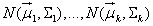
* 那么这个样本集合的概率密度分布函数可以表示为
 
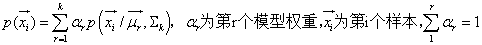

* 那么样本集合的概率密度分布函数为：
 
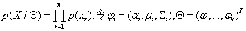

* 然后根据上述的公式计算参数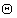

**那么问题来了，怎么根据公式来计算，从而得到混合高斯模型呢？** 如果样本的类型已知，就好办，我们只需要在不同类型的样本集合上分别计算对应的多维高斯分布函数(参考多维高斯函数计算方法)就万事大吉。但大部分情况是样本的类型未知，即**包含隐含变量**.
**对包含隐含变量的参数的计算最好使的方法就是EM算法(最大似然估计)**，这里也莫过于此。
	
#### 使用EM估算混合高斯模型参数
样本集合的概率密度分布函数是乘积的方式，为方便处理，我们转换为相加:
 
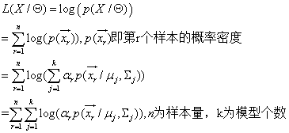

到这里为止，我们只需要通过EM算法，估算出，是的上述这个公式的值最大就行了。
> 为什么是求最大值，而不是最小值；根据小概率而言，我们认为小概率事件一般不会发生；相反，我们已经得到这组样本，即认为这组样本出现的概率最大，这就是为什么求最大值而不是最小值的依据。

具体怎么使用EM来估算混合高斯模型的参数，可以参考[EM算法](http://www.cnblogs.com/jerrylead/archive/2011/04/06/2006936.html)。

