title: 自组织神经网络-SOFM
date: 2015-08-03 20:09:13
tags: 聚类 算法
---
神经网络作为一种机器学习算法，可以理解为，***将输入矢量数据（输入元）映射到神经网络中各个神经元的过程***，映射的过程也是聚类的过程。整个神经网络类似于人的大脑，由许多神经元组成，人大脑不断接受外部信息进行学习，最后形成不同(或不同区域)的神经元只负责响应一种类型的输入信息，如一部分神经元只负责声音信息，另一部分只负责触觉信号等等。***机器学习中的神经网络相同，训练数据不断对神经网络进行训练，训练过程中，不同的神经元会不断对某一类型输入类型(某一输入模式)的响应增强并且是响应最大者；训练结束时，对某一模式的输入数据响应最大的神经元就是这种模式数据的代表(或者说是类型)。***

#### 神经网络有两种实现非监督式学习的方式:

- ***Hebbian规则***， 通常不是被用来分析输入信息间的聚类关系或分类关系，而是测量输入信息间的相似性或分析输入信息中的主要成分向量 (principle components)”。

- ***竞争学习规则***， 使用竞争学习的神经网络，只有其中的一个神经元会被激活。该神经元就称为胜者 (winner)”。这种神经网络通常用来做聚类分析。即在无先验知识的情况下，发现或挖掘输入信息本身的结构及聚类关系。

而SOFA则是神经网络的一种，称为***自组织神经网络***，也属于竞争神经网络的一种，但区别于简单的竞争神经网络， 简单竞争神经网络只一个神经元对某一种输入模式作为响应；其他神经元不做响应； 而SOFM则是一个区域内的神经元对某一个输入模式做出相应，只是其中一个神经元作为主神经元，其响应最大。

 ---

# 竞争神经网络
竞争神经网络在无教师信息的情况下能够自组织地挖掘输入信息的特征，以便对输入进行聚类处理。此类神经网络经常被用来作为前处理单元 (preprocessing unit)，以便抽取出输入信息的特征，或将输入信息矢量量化 (vector quantization) 之后再进行监督式学习。

### 竞争学习的目的
竞争学习过程是对输入矢量的聚类过程，是使得获胜节点获得最大响应的过程，是使获胜节点与输入矢量之间的权矢量逐渐逼近输入矢量。当训练结束后，对于某类输入模式P，一定有一个网络输出节点有最大响应（输出值为1），其余输出节点无响应（输出值为0）。该最大响应输出节点与输入节点之间的权矢量等于或代表此输入矢量。

### 竞争网络结构

   
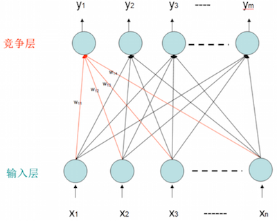

神经网络分为输入层和竞争层，输入层的每一个节点代表输入矢量的一个维度(或一个属性)； 竞争层的每一个节点则代表一个神经元，训练结束后，每一个神经元将对应一种输出类型。神经网络中输入层的每个节点与竞争层的所有节点相连，从而竞争层的每个节点获取输入层的矢量加权和。

### 竞争网络的学习过程

- 确定winner (competitive phase) ：按一定的准则计 算每个输出节点与输入矢量之间的权矢量与输入矢量之间的逼近度,最逼近的为winner. 假设一个输入模式(x1, x2 ,…., xn), 输入节点到神经元y1的权重矢量为(w1, w2,…wn), 那么输入模式到该神经元的距离为, 距离最小的那个神经元就是该输入模式的获胜者。

- 调整权矢量(reward phase) ：按一定的准则调整 winner的权矢量 调整神经元的权向量，使得权向量更接近输入模式矢量，从而使得该神经元对该输入模式或相似的输入模式响应更强烈；这里的输入模式我们可以理解为某一类型相似的数据。神经元权重调整公式：
 
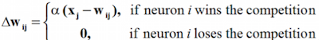

>- In simple competitive learning ，only the winner is allowed to learn (change its weight). 
- In self-organizing maps， winner and other neurons in the neighborhood of the winner may learn.

>**另外，解释一下输入模式到神经元的距离计算和权重值调整**： 从上面的距离计算公式可知，某一输入模式到某一个神经元的距离其实是该输入模式(向量)到权重矢量方向上的投影；可见角度越小，输入模式在权重矢量上的投影值越大，表明该输入模式与该神经元的距离越大；距离最小(与输入模式向量的角度最小)的神经元将成为获胜者。 而权重的调整则是对权重矢量方向的调整，是的权重向量的方向更接近该输入模式的方向； 那么下次仍能够对相同或者相似的输入模式做出最大响应并且响应更强烈(ps:一旦某个神经元成为某个输入模式的获胜者，那么该神经元将一直会对该输入模式做出最大响应)。
 
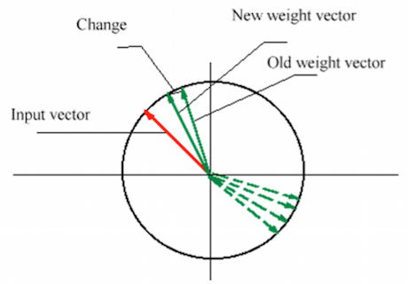

### 竞争学习过程例子

假设一个神经网络，输入向量是二维的，并且有三个神经元。三个神经元初始的权重向量分别是W1=[0.27, 0.81], W2=[0.42, 0.70], W3=[0.43, 0.21]。  对于某一个输入模式X=[0.52, 0.12], 到三个神经元的距离分别是：
  
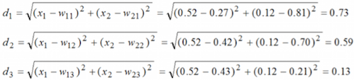

该输入模式到第三个神经元的距离最小，该神经元成为获胜神经元。  更新所有神经元的权重 简单竞争神经网络，只更新获胜神经元的权重，而对于SOFM，则还要更新获胜神经元周围的神经元的权重，这也是SOFM的最大区别点。假设⍺=0.1, 那么获胜神经元的权重更新为W3=[0.43, 0.21] + △w = [0.43, 0.21] + 0.1* [0.52-0.43, 0.12-0.21] = [0.44, 0.20]。

----

# 自组织竞争网络

一般竞争网络适用于具有典型聚类特性的大量数据的辨识，但当遇到大量的具有概率分布的输入矢量时，竞争网络就无能为力了，这时可以采用SOFM网络来解决。SOFM网络也采用竞争学习方法，但强调邻域的作用。因此，相应的竞争策略略有不同，即不但获胜者而且其邻域的神经元也调整权重。

SOFM类似于人类的大脑，人类的大脑具有不同的功能区。比如，负责触觉、视觉和听觉等的感应器分别对应到大脑皮质的不同区域；这种对应或映射关系并不是天生就固定不变的，而是在神经系统的发展初期时所决定的。

  
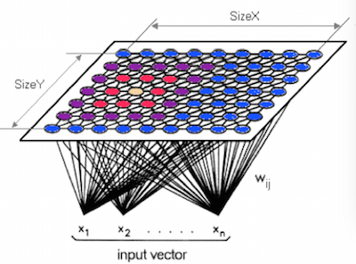

SOFM同样分为输入层和竞争层，如图所示的输入层为n维向量，竞争层则是二维曲面。

>这里解释一下竞争层为什么是二维曲面而不是二维平面. 首先需要明确的是，竞争层是几维结构并不与输入层的维度相关，而是与神经元周围有几个相连神经元决定；假如竞争层是一维曲线，那么每个神经元只与另外另个神经元相连(即只有它前后两个神经元能够影响到它的权重)；如果是二维曲面，那么与其相连的神经元是分布在一个曲面上的(可能所有神经元是分布在三维空间，但二维神经网络的竞争层只能是三维空间的一个曲面)。那么为什么是曲面，而不是平面， 这由于输入层的维度相关，假如输入层是三维，那么每个神经元的权重是由三个维度标示，即对神经元的描述是在三维空间中的。 设想一下，一个三维空间，里面各个角落分布了100个点，每个点是一个神经元，每个神经元在三维空间的坐标表示该神经元的三维权重；不同的输入模式会映射到三维空间的某一个神经元上；如果这些神经元的相连关系是分布在一个三维空间的一个曲面上的，那么这个是二维神经网络；如果这些神经元相连关系是分布在三维空间的一个曲线上的，那么这个是一维神经网络。只有输入层是二维的时候，二维神经网络的神经元才会分布在一个平面上.

**SOFM与一般竞争网络的区别就是神经元之间不相互独立，而是存在紧邻和远邻关系**，在更新获胜神经元的权重的时候，也需要同时更新紧邻和远邻神经元的权重，更新原则就是：**近邻神经元互相激励（正方向更新）， 远离神经元互相抑制(负方向更新)**。

### SOFM学习过程

* 为了能使二维输出平面上相邻的输出结点对相近的输入模式类作出特别反应，在训练过程中需定义获胜结点的邻域结点。
* 假设本次获胜结点为Nj，它在t时刻的邻域结点用NEj(t)表示，NEj(t)包含以结点Nj为中心而距离不超过某一半径的所有结点。
* 随着训练的进行， NEj(t)的半径逐渐缩小，最后只包含获胜结点Nj自身，即在训练初始阶段，不但对获胜的结点做权值调整，也对其较大范围内的几何邻接结点做相应的调整，而随着训练过程的继续，与输出结点相连的权向量也越来越接近其代表的模式类。
* 在训练结束后，几何上相近的输出结点所连接的权向量既有联系（类似性）又互相区别，从而保证对于某一类输入模式，获胜结点能做出最大响应，而相邻结点做出较大响应。
 
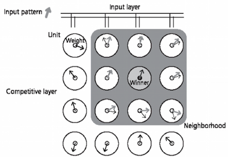

训练过程中，输入模式反复输入，初始权重（黑色箭头）是随机的，获胜神经元（灰色单元）的权重最匹配输入模式，而其邻域（灰色邻域）中的单元的权重也被适当调整（灰色箭头表示调整后的权重向量）。

1. **初始化**： 以较小的值初始化各个神经元的权重向量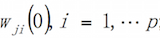, 归一化权重相连与输入样本；初始化初始邻域Nc(0), 学习速率η(0)和训练次数T。

2. **随机选取某样本输入**：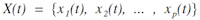

3. **竞争**：在输出节点中计算寻找最佳匹配节点C ,即其权向量与输入向量的欧氏距离最小的神经元

4. **更新获胜神经元极其邻域内神经元的权重:**
 

5. **更新学习速率和邻域范围:**     
 
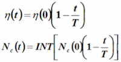

6. **判断迭代次数t是否大于或等于T，若是则结束，否则转向2.**

>**注 1：**对于学习速率的调整，建议使用:
 
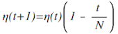
              
  其中初始值可以约为1， t为迭代次数，T为迭代总次数，随着迭代的进行，学习速率逐渐减小。

>***注 2：***对于邻域范围，建议使用:
 
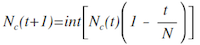

### SOFM的优缺点

**优点**：

- excellent for classification problems
- can greatly reduce computational complexity
- high sensitivity to frequent inputs
- new ways of associating related data
- no need of supervised learning rules

**缺点**：

- system is a black box
- error rate may be unacceptable no guarantee of network convergence for higher dimension networks
- many problems can't be effectively represented by a SOFM
- a large training set may be required
- for large classification problems, training can be lengthy

----
# 几种SOFM运算的改进

### 对神经网络进行划分，实现并行计算
简单的讲，就是将单个神经网络划分为多个子神经网络，每个神经网络中只包含**部分神经元**。
在训练过程中，将全量训练数据集合中的每一条训练数据，都输入到每个子神经网络中进行训练；**各个子神经网络的训练过程互不干扰，可以通过并行操作来提高训练速度**。假设一条训练数据，其训练过程可以描述如下：

- 将这条训练数据同时输入到每个子神经网络中进行学习。
- 各个子神经网络执行并行计算，并各自找出一winner。
- 然后从所有的winner中选取最后的winner(当然这一步无法并行操作)。
- 最后根据winner并行的更新各个子神经网络中神经元的权重。

 
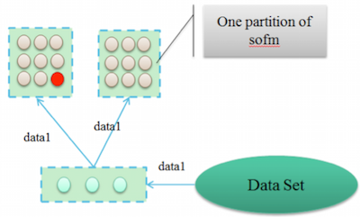

### 对训练数据进行划分，实现SOFM的并行训练
上面的方法是对神经网络进行划分，而这个方法则是对训练数据进行划分。将训练数据划分成n个子训练数据集，每一个数据集都对应一个完整的SOFM网络。并且引入一个“epoch”的概念，epoch是我们对整个训练过程在时间上的一个划分。假设有n个子训练数据集，学习过程如下：

- 并行的在每个子训练数据集上进行训练。
- 经过一个“epoch”后，将会得到n个神经网络，并行的更新每个神经网络中神经元的权重，假如经过一个epoch之后，某一个神经元在n个神经网络的权重变化值分别为△w0,△w1,.：..,△wn， 那么这个神经元新的权重为Wnew= Wold + △w0 + △w1 + ..

 
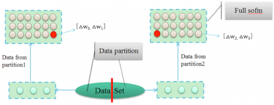

Difference with base SOFM : update neuron’s weight vector once after a epoch.

### 一维SOFM的改进

- Learn one-dimension sofm by training data.
- cluster neurons of SOFM into groups, each group has a threshold.
- Compute quantization errors of SOFM for sample.
- If quantization errors is bigger than threshold of the group , the sample is outlier(abnormal).

 
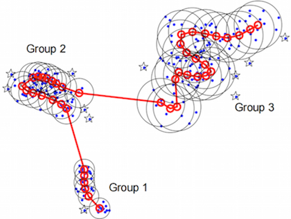

